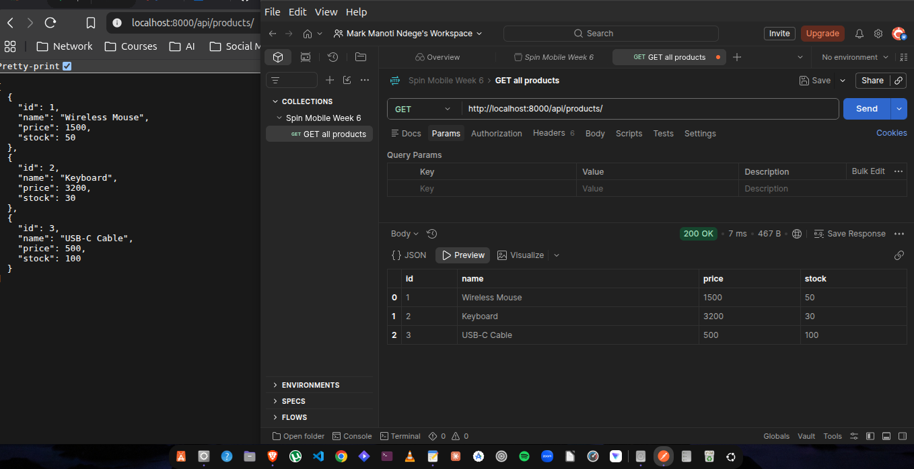
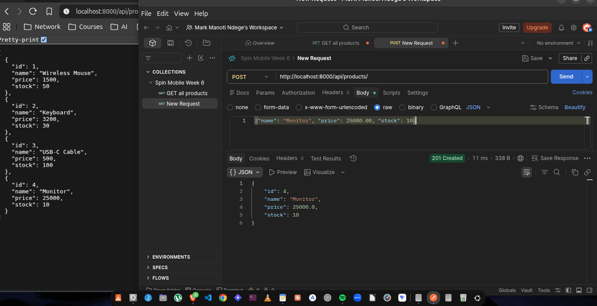
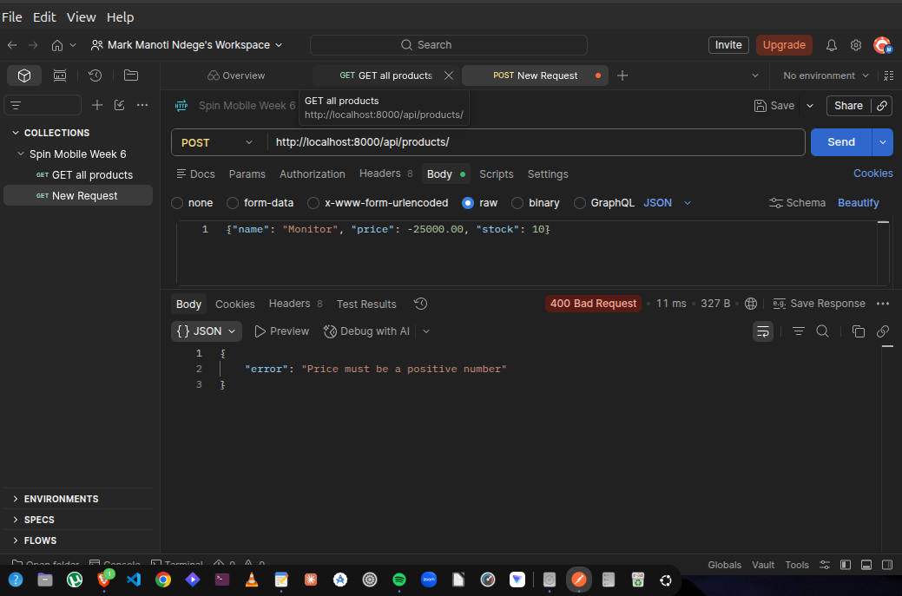
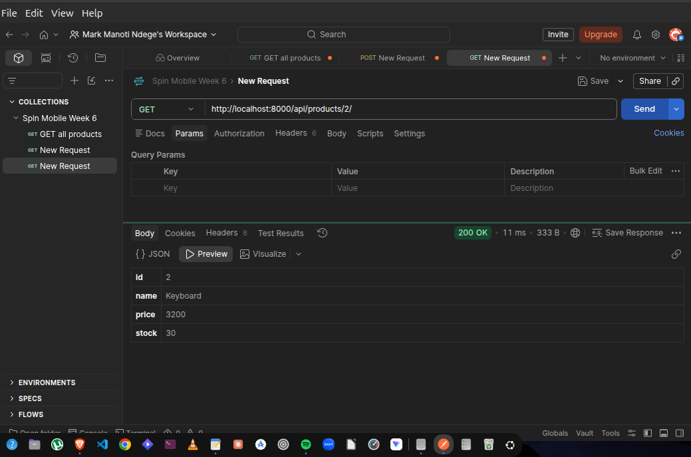
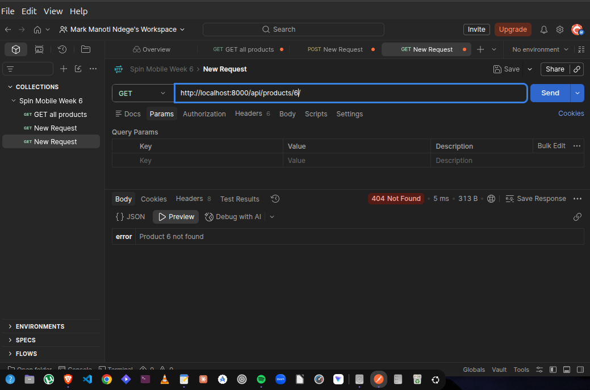
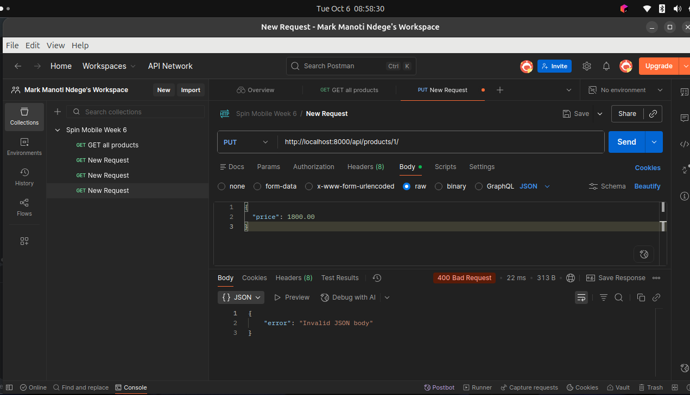
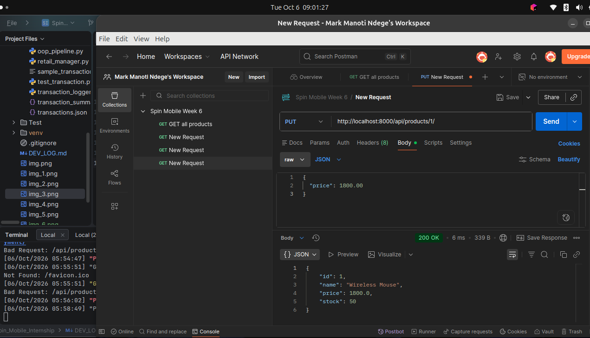
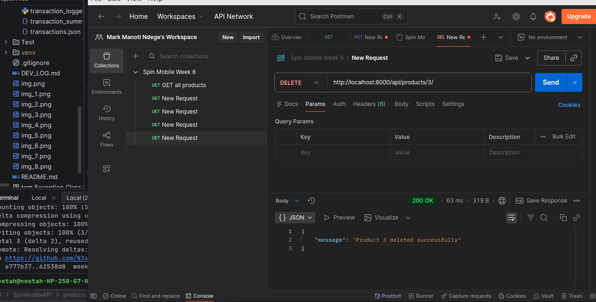
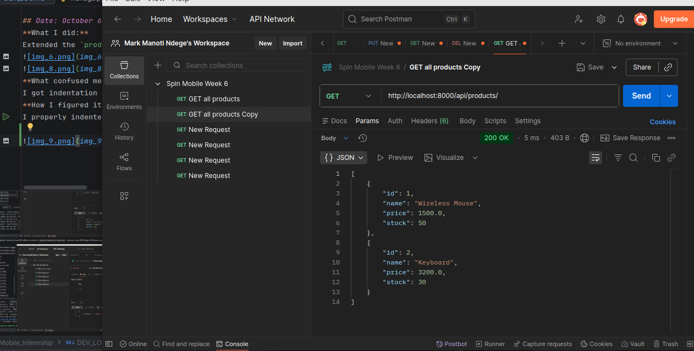
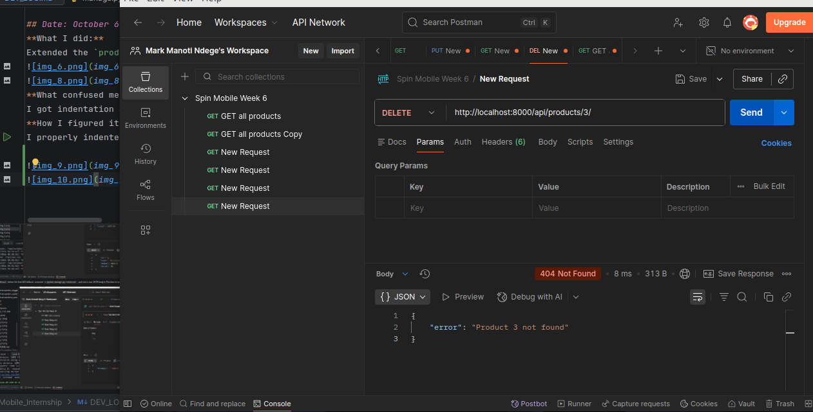

# Development Log

## Date: September 25, 2026
**What I did:** Wrote an automated unit test using `pytest` to verify that the `Transaction` class correctly instantiates and formats its attributes.
**What confused me:** The test failed with `AttributeError: 'Transaction' object has no attribute 't_type'`. 
**How I figured it out:** I looked closely at the `pytest` failure summary, which actually suggested `Did you mean: 'type'?`. I realized that while the internal parameter was named `t_type` in the constructor, I had encapsulated it using a `@property` decorator named `type`. I updated the assertion to `assert t.type == "income"` and the test passed.

# Development Log
## Date: September 28, 2026
**What I did:** 
Built an interactive command-line math calculator (`randomtest.py`) using `try/except/finally` blocks to handle invalid user inputs without crashing the program.
**What confused me:** 
The program was still crashing when I entered text instead of numbers, and my exception handling wasn't working. I originally tried stacking multiple `try` statements back-to-back for each math operation and tried to catch a non-existent `CalculationError`.
**ERROR:** 
`ValueError` (from converting input to float before the try block) and `SyntaxError` (from stacking `try` blocks without matching `except` blocks).
**How I figured it out:** 
I learned three critical rules about exception handling in Python:
1. **Dangerous Code Placement:** `float(input())` is "dangerous" and must be placed *inside* the `try` block to safely catch text/typing errors.
2. **No Stacking:** Every `try` block must be immediately followed by an `except` or `finally` block. 
3. **Built-in Exceptions:** You must use standard Python exceptions like `ZeroDivisionError` instead of making up names like `CalculationError`.

**What I did:** Built a data aggregator script (`Test/aggregator.py`) to parse raw text data (`'income: 500'`), extract the categories and amounts, and calculate running totals using a dictionary.
**What confused me:** I had to make sure I didn't trigger a `KeyError` by trying to add an amount to a category that didn't exist in the dictionary yet.
**How I figured it out:** I used a string `.split(': ')` method to separate the text from the number and cast the number to a `float`. To handle the dictionary safely, I initially used an `if category in totals:` block to check if the key existed before adding to it.
I then learned the "Pythonic" shortcut to do this in a single line without `if/else` statements using the `.get()` method:
`totals[category] = totals.get(category, 0) + amount`

# Development and Learning Log

## Date: September 29, 2026
**What I did:**
Transitioned from standalone Python scripts to web software architecture. Studied the Client-Server model and mapped HTTP methods (GET, POST, PUT, DELETE) directly to SQL CRUD operations along with their status codes (200, 201, 204, 400, 404).
**What confused me:**
I initially thought the server initiated conversations, and I mistakenly assigned the `PUT` method to a scenario where I was trying to fetch a product that doesn't exist. 
**How I figured it out:**
I learned that the **client** (browser, Postman, mobile app) always initiates the HTTP Request, while the server runs permanently, waiting to respond. I also realized that *fetching* data must always use a `GET` request (mapping to SQL's `SELECT`), even if the final result is a `404 Not Found` error, because `GET` requests must never modify data.

**What I did:** 
Studied REST (Representational State Transfer) architecture, focusing on building stateless APIs and resource-based URL routing with JSON payloads.
**What confused me:** 
I initially included action verbs in my API endpoints (like `/createNewOrder` and `/getAllProducts`) and used singular nouns for the resources (like `/api/order`). 
**How I figured it out:** 
I learned the golden rule of REST: the URL dictates *what* the resource is (using plural nouns), and the HTTP method dictates *how* to interact with it (the verb). I corrected my endpoints to use collection-based URLs (e.g., `POST /api/orders/` to create, `GET /api/products/` to fetch all) and appended IDs to fetch specific records (e.g., `GET /api/posts/7/`).

**What I did:** 
Studied Django's architecture, specifically the difference between a Project (the global configuration) and an App (a self-contained feature module). Mapped out Django's two-level URL routing system.
**What confused me:** 
How Django knows where to send an incoming HTTP request and how it extracts data from the URL itself.
**How I figured it out:** 
I learned the exact request chain: Django checks the project-level `urls.py` first, uses `include()` to hand off the request to the app-level `urls.py`, and then uses path converters like `<int:product_id>` to capture URL parameters and pass them as variables directly into the view function.

# DSA Challenge — Fridays at Month End

## Date: September 30, 2026
**What I did:**
Wrote the `month_ends_on_friday` helper function to isolate the logic for finding a specific month's last day and checking its weekday.
**What confused me:**
I wasn't entirely sure why we needed to construct a specific "date object" instead of just using numbers.
**How I figured it out:** 
I learned that`datetime.date`creates an intelligent calendar object that inherently knows its own properties, and Python's`.weekday()`method counts days starting at 0 for Monday, making Friday exactly 4.

**What I did**
Wrote the`count_for_year`function to iterate through all 12 months of a given year and accumulate a count of how many end on a Friday.
**What confused me** 
Getting to remember upper bound of a sequence works in Python loops. 
**How I figured it out:**
Learned that the range(start, stop) function is exclusive at the upper bound, meaning  `range(1, 13)`  is required to successfully loop from 1 to 12.

**What I did:**
Wrote the final `count_last_friday_months` function that handles both single years and year ranges using default parameters.
**What confused me**
I needed to figure out how a function could accept either one or two arguments without throwing a missing parameter error.
**How i figured it out**
I learned to use `year2=None` as a default parameter, and then wrote a quick if statement to set `year2 = year1` if no second argument is provided.

## FIRST DJANGO PROJECT

**What I did:** 
Initialized my first Django project (`SpinMobileAPI`) and app (`products`) inside an isolated Python virtual environment (`venv`) to protect my global packages. I also verified the installation by starting the development server.
)
**What confused me:** 
Why Django creates two folders with the exact same name (`SpinMobileAPI/SpinMobileAPI`).
**What I learned:** 
I learned that the outer folder is just a root container for the repository, while the inner folder is the actual Python package containing the project's configuration files (like `settings.py` and `urls.py`).
---
**What I did:** 
Created an in-memory data store and built my first Django view (`product_list`) to return a JSON response. I also configured URL routing at both the project and app levels, and successfully tested the `GET` endpoint in Postman.

**What confused me:** 
Why routing requires two different `urls.py` files (one in the project folder and one in the app folder) and how they connect.
**What I learned:** 
I learned that the project-level `urls.py` acts as a master traffic cop. It catches the base `api/products/` path and uses `include()` to hand the request off to the app-level `urls.py`, which then maps the empty path `''` directly to the `product_list` view.
----
**What I did:** 
Built a POST endpoint to create new products. I used `json.loads()` to parse the raw HTTP request body and added validation logic to catch missing fields or invalid (negative) prices, returning a `400 Bad Request` if validation fails and a `201 Created` when successful.

----
**What I did:** 
Built a `product_detail` view and URL pattern supporting `GET /api/products/<id>/`. I used Python's `next()` generator expression combined with a default `None` argument to find specific products by ID safely, returning a `404 Not Found` error if the product doesn't exist.

## Date: October 6, 2026
**What I did:** 
Extended the `product_detail` view to handle `PUT` requests for updating an existing product. Implemented partial updates so clients can modify individual fields (like price) without overwriting other attributes.

**What confused me:** 
I got indentation and syntax errors when placing the `elif request.method == "PUT":` block outside of the `product_detail` function, and Postman showed "Could not send request" when the dev server wasn't running.
**How I figured it out:** 
I properly indented the `elif` block inside `product_detail` before the final 405 fallback, restarted `python manage.py runserver`, and sent a raw JSON body in Postman to receive a successful `200 OK` response.

**What I did:** Implemented the `DELETE` method in the `product_detail` view (`DELETE /api/products/<id>/`) to remove a product from the in-memory `_products` list by ID, returning a `200 OK` status code with a JSON confirmation message. Verified in Postman that deleting an existing product succeeds and subsequent requests to the same resource yield a `404 Not Found`[cite: 8].

**What confused me:** Why some REST standards recommend returning a `204 No Content` status code with an empty body for deletions instead of a `200 OK` with a JSON message.
**How I figured it out:** I learned the trade-off between strict REST compliance and developer experience: `204 No Content` is the strict REST standard and saves network bandwidth by sending zero body bytes, whereas `200 OK` with a JSON message provides explicit, human-readable confirmation during development and testing in Postman.